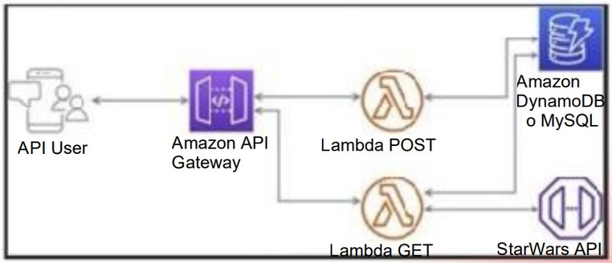

# Reto Técnico - Backend NodeJS AWS

## Descripción del reto técnico:

- ❌ Adaptar y transformar los modelos de la API SWAPI a español, es decir tienenque mapear todos los nombres de los atributos del inglés al español. Ejemplo:{ “name” : “Luke”} cambiar a {“nombre” : ”Luke”}.
- ❌ Integrar la API de prueba StarWars API (líneas abajo está el link) se debenintegrar uno o más endpoints.
- ❌ Crear un modelo de su elección mediante el uso de un endpoint POST, la datase tendrá que almacenar dentro de una base de datos.
- ❌ Crear un endpoint GET que muestre la data almacenada.
- ❌ API de prueba SWAPI:
- ❌ https://swapi.py4e.com/documentation

## Puntos mínimos-obligatorios del MVP:

- ❌ Mínimo 2 endpoints, GET para recuperar la información y PST para crear unelemento
- ❌ Integración con una base de datos (DynamoDB o MySQL)
- ❌ Integración con SWAPI
- ❌ Traducción de atributos de inglés a español
- ❌ Uso de Serverless Framework
- ❌ Uso de Node.js
- ❌ Respeto de las buenas prácticas de desarrollo

## Puntos Bonus:

- ❌ Pruebas unitarias
- ❌ Uso de TypeScript
- ❌ Documentación de uso
- ❌ Documentación en Open API/Swagger
- ❌ Desplegar sin errores en AWS con el comando deploy del framework serverless
- ❌ Mayor complejidad de Integración
- ❌ Uso de un framework
- ❌ Trabajar en capas y por dominio

### Arquitectura recomendada



## Project setup

```bash
$ pnpm install
```

## Compile and run the project

```bash
# watch mode
$ pnpm run dev
```
